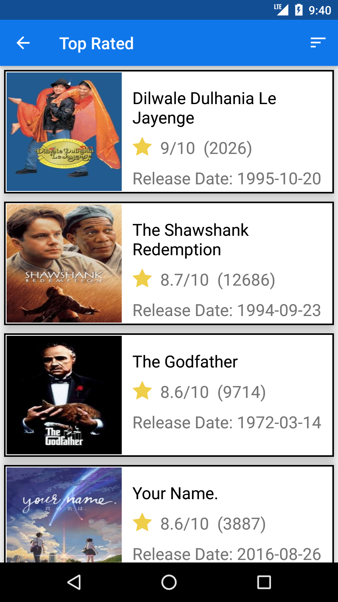

# MovieDatabase

This is a Android Project which has a Datbase for Movies.
It helps you to categorize your movie selection as per your convenience.
These are some screenshot of this application.

    

As you see in upper screenshots the movie is caregtorized in 3 sections Most Popular,In theaters and Top Rated.

When you click on "SEE ALL" you will get a bigger list of movies of that particular section. You can see that in the screen shot below.

  

On the right side of the toolbar there is a sorting menu which helps you to sort your list as per the options given in the menu.

Whenever you click on a movie you will be directed to the details of that particular movie.

 

So this is the small introduction of this Android Application.

There more updates which are coming soon so stay tuned.
If you want the apk, then please go to the "Build-APK" folder in the repository.
Please let me know your views in the comments. It will be very helpful for me.

Thank you.
